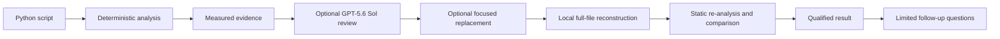

<div align="center">

# CodeSage

### Your Python maintainability coach

**Measure first. Explain second. Refactor if necessary.**

<p>
  <a href="https://codesage-maintainability.streamlit.app/">
    
  </a>
  
  
  <a href="LICENSE">
    
  </a>
</p>

**[Try the live app](https://codesage-maintainability.streamlit.app/)**

Built as a solo project for **OpenAI Build Week - July 2026: Developer Tools**.

</div>

---

## What is CodeSage?

CodeSage is an educational app that helps developers examine the maintainability of a Python script.

It measures the structure of the code, highlights the most important maintainability issue and explains what could be improved. The user can then ask for a focused refactor. CodeSage checks the suggested version and only displays it if it improves the issue without making another measured maintainability problem worse.

CodeSage never runs the submitted code or the suggested replacement.

I built CodeSage to explore a practical question:

> **How can AI help developers understand and improve their code without asking them to trust its suggestions blindly?**

The measurements come from static analysis, not the AI model. **GPT-5.6 Sol** is used to explain the selected issue, propose a focused change and answer questions about the result. CodeSage then checks the proposed change against the original measurements and file structure.

**CodeSage checks the AI’s suggestions against measured evidence, while the developer retains the final decision.**

<br>

| 🔍 **Measure** | 💡 **Understand** | 🛠️ **Improve** |
| :---: | :---: | :---: |
| Analyse Python without executing it | Use GPT-5.6 Sol to explain measured findings | Explore a focused AI-assisted refactor |
| Identify priority maintainability hotspots | Connect advice to visible evidence | Re-analyse the proposed change |
| Keep measurements and thresholds visible | Ask follow-up questions about the result | Show what improved, stayed unchanged or worsened |

---

## See the workflow

### 1. 🔍 Measure the code

CodeSage first analyses the complete Python script without using generative AI. It identifies structural maintainability indicators and selects up to three priority hotspots using visible measurements and thresholds.


<p align="center"><em>The built-in example has one priority hotspot selected from its measured findings.</em></p>

### 2. 💡 Understand the evidence

AI review is optional. When requested, **GPT-5.6 Sol** explains the measured findings, identifies the relevant code and suggests checks or improvements to consider.

The review uses evidence produced by CodeSage, so the model does not have to estimate the measurements itself. CodeSage validates evidence references and source locations before accepting the review.


<p align="center"><em>The AI explains the measured issue while CodeSage keeps the supporting evidence visible.</em></p>

### 3. 🛠️ Explore a focused refactor

If the review supports a useful change, the developer can request a suggested refactor.

GPT-5.6 Sol generates a replacement only for the selected function or method. CodeSage preserves the rest of the file, reconstructs the complete source locally and analyses the proposal again. The model can also decline to generate a refactor when it cannot justify a useful change.


<p align="center"><em>Only the selected target is generated; CodeSage reconstructs and checks the complete file locally.</em></p>

### 4. ✅ Inspect what actually changed

CodeSage keeps before-and-after measurements visible. It shows improvements, unresolved findings and trade-offs.


<p align="center"><em>Changed and unchanged measurements remain available for review.</em></p>

> [!IMPORTANT]
> **What does verification mean here?**
>
> CodeSage checks generated refactors against defined static, structural and maintainability conditions. This does **not** prove behavioural equivalence, runtime correctness, security or performance improvement. Any suggested change still requires human review and testing.

### 5. 💬 Ask CodeSage

After a successful review, users can ask follow-up questions about the current result: why an issue has been flagged, which checks to run, why a measurement changed or what CodeSage could not verify.

Ask CodeSage uses the completed analysis, cited evidence, selected target and verified comparison as context. It can explain the result but it cannot generate replacement code.


<p align="center"><em>This is deliberately not a general purpose coding chatbot. The conversation is limited to the current result.</em></p>

---

## Where does the human stay in control?

| Stage | CodeSage | GPT-5.6 Sol | Developer |
| --- | --- | --- | --- |
| 🔍&nbsp;**Measure** | Measures the source code and identifies hotspots | Not involved | Chooses what code to analyse |
| 💡&nbsp;**Understand** | Supplies measured evidence | Explains findings and possible improvements | Judges whether the explanation is useful |
| 🛠️&nbsp;**Refactor** | Selects and constrains the refactor target | Proposes a focused change or can abstain | Chooses whether to request a refactor |
| ✅&nbsp;**Inspect** | Re-analyses the proposal and can reject it | Does not approve its own output | Reviews and tests any suggestion before use |
| 💬&nbsp;**Ask** | Supplies limited context from the current result | Answers within that context | Decides what to ask and how to use the answer |

> **CodeSage checks the AI’s suggestions against measured evidence, while the developer retains the final decision.**

---

## What testing changed

I tested CodeSage with a Python script containing nearly 50,000 characters. The early results exposed an important problem: a refactor could improve one measurement while making another worse.

One suggestion reduced the nesting depth from 5 to 3 and removed the two issues it was intended to address. However, it also increased cyclomatic complexity from 6 to 7. Another suggestion fixed the mutable-default issue but left the nesting depth at CodeSage's deep-nesting threshold.

These results changed how CodeSage handles generated code. It now withholds a suggestion unless:

- all the issues identified for the selected function have been addressed;
- at least one measured maintainability factor has improved;
- no new maintainability issue has appeared;
- complexity, nesting depth, parameter count and issue counts have not become worse; and
- the rest of the file has been preserved.

This does not prove that the refactor is correct or ready to use. It means the suggestion passed the specific static checks CodeSage can perform.

---

## Built with

| Area | Technology |
| --- | --- |
| Product | Python 3.11, Streamlit, Python `ast`, Radon, Pydantic, HTTPX |
| AI features | OpenAI Responses API, GPT-5.6 Sol |
| Development & testing | Codex (VS Code), pytest, Ruff, Git and GitHub |
| Deployment | Streamlit Community Cloud |

---

## Building CodeSage with GPT-5.6 Sol

CodeSage was built as a solo project for **OpenAI Build Week - July 2026: Developer Tools**, using Codex as a development assistant through VS Code.

I made the product and scope decisions and Codex helped with implementation, API integration, debugging, testing and documentation. This included the analysis modules, structured OpenAI responses, targeted refactoring and investigating state management issues on Streamlit.

The hackathon timeframe encouraged a limited workflow that could be implemented and tested:

- deterministic analysis remains useful without AI;
- explanation is separate from code generation;
- refactoring is limited to one selected target at a time;
- generated changes can be rejected by the application;
- the model can decline to suggest a refactor;
- measurements, uncertainty and limitations remain visible;
- submitted and generated code is never executed.

Repository level analysis, additional languages and runtime verification were left outside the hackathon scope.

---

## Design decisions

My original idea was connected to my wider research into software sustainability, but the hackathon scope was too small to support meaningful claims about sustainability, energy use and maintainability at the same time. I narrowed CodeSage to a problem that could be measured and tested more carefully: **Python maintainability**.

During development I also rejected the idea of giving code a single overall “quality score”. Different measurements can move in different directions after a refactor, and one aggregate number could conceal useful trade-offs.

That led to the core design principle behind CodeSage:

> **Use deterministic methods for what can be measured, use AI where interpretation and exploration add value, and keep the distinction visible to the user.**


---

## Try CodeSage

The quickest way to explore the project is through the built-in example.

1. Open the **[live app](https://codesage-maintainability.streamlit.app/)**.
2. Select **Built-in example**.
3. Choose **Analyse code**.
4. Inspect the priority hotspot and measured findings.
5. Explore the **Measurements & evidence** workspace.

You can also analyse pasted Python, upload a `.py` file or load one supported public GitHub `.py` file.

> [!NOTE]
> **Hosted AI access**
>
> Deterministic analysis is available publicly on the hosted app and does not require an API key.
>
> Hosted AI review, targeted refactoring and follow-up questions are access-controlled to prevent unauthorised use of the deployment's API allowance.
>
> To use the complete AI workflow independently, run CodeSage locally with your own OpenAI API key.

---

## Technical details

The sections below cover measurements, architecture, local installation, usage, testing and current limits.

<details>
<summary><strong>What CodeSage measures</strong></summary>

<br>

CodeSage currently analyses:

- cyclomatic complexity and complexity rank;
- maximum nesting depth;
- source lines of code (SLOC);
- statement count;
- effective parameter count;
- complex Boolean conditions;
- mutable default arguments;
- broad and bare exception handling;
- module-level procedural size;
- top-level structure.

It selects up to three priority hotspots using documented thresholds and deterministic ordering. There is no hidden overall maintainability or quality score.

</details>

<details>
<summary><strong>How the AI workflow works</strong></summary>

<br>

GPT-5.6 Sol is used only after an explicit user action, for three optional tasks:

1. explaining CodeSage's measured findings;
2. deciding whether a focused refactor is worth suggesting and generating that replacement;
3. answering follow-up questions about the completed result.

The model returns structured responses. CodeSage validates evidence references, source locations, replacement scope and resulting measurements before displaying the appropriate result.

If a parsed review contains an invalid evidence reference, CodeSage may make one tightly limited citation-correction request. It does not guess or silently replace a reference.

For refactoring, the model returns one selected function or method. CodeSage reconstructs the complete script locally, then checks:

- valid Python syntax;
- a real change to the approved target;
- improvement in the targeted maintainability issue;
- no new measured smells;
- required imports, classes, functions, methods and signatures;
- preservation of unrelated definitions.

If a useful refactor cannot be justified, the review can recommend no refactor. CodeSage can also reject a generated replacement that fails its checks.

Ask CodeSage receives only limited, result-specific context: the review's cited evidence, approved target source, any verified target replacement, relevant measurements, warnings, safety checks and a limited recent conversation history. It cannot generate or modify code through the chat response.

</details>

<details>
<summary><strong>Architecture</strong></summary>

<br>

The application owns the measurements and acceptance checks. GPT-5.6 Sol explains findings and proposes a focused change; it does not control the deterministic evidence.



The **Measurements & evidence** workspace includes analysed units, thresholds, warnings, evidence cited by the AI review, before-and-after measurements and structural-preservation results.

CodeSage also produces a print-friendly report. For large scripts, the report may omit duplicated complete-file listings while retaining the focused diff, measurements and evidence.

</details>

<details>
<summary><strong>Run CodeSage locally</strong></summary>

<br>

### Requirements

- Python 3.11
- Git
- an OpenAI API key for optional AI features

Deterministic analysis does not require an OpenAI API key.

### 1. Clone and create an environment

```bash
git clone https://github.com/salslifelist/CodeSage-Python-Maintainability-Coach.git
cd CodeSage-Python-Maintainability-Coach
python -m venv .venv
```

Windows PowerShell:

```powershell
.venv\Scripts\Activate.ps1
```

macOS or Linux:

```bash
source .venv/bin/activate
```

### 2. Install CodeSage

```bash
python -m pip install --upgrade pip
python -m pip install -e .
```

### 3. Configure optional AI features

The current application uses a local access-code gate as well as the OpenAI credential. Choose your own local access-code value; it is not an OpenAI API key. Never commit either value.

Windows PowerShell:

```powershell
$env:AI_ENABLED="true"
$env:JUDGE_ACCESS_CODE="choose-a-local-access-code"
$env:OPENAI_API_KEY="your-openai-api-key"
$env:OPENAI_MODEL="gpt-5.6-sol"
```

macOS or Linux:

```bash
export AI_ENABLED="true"
export JUDGE_ACCESS_CODE="choose-a-local-access-code"
export OPENAI_API_KEY="your-openai-api-key"
export OPENAI_MODEL="gpt-5.6-sol"
```

When CodeSage asks for the AI access code, enter the same value you assigned to `JUDGE_ACCESS_CODE`. Leave all four AI variables unset to run deterministic analysis only.

> [!CAUTION]
> Keep `OPENAI_API_KEY` and your access-code value out of the repository, screenshots, logs and support requests. CodeSage does not need either secret to perform deterministic analysis.

### 4. Start the app

```bash
streamlit run app.py
```

Streamlit normally serves the local app at `http://localhost:8501`.

</details>

<details>
<summary><strong>How to use the app</strong></summary>

<br>

1. Choose an input route: paste Python, upload a `.py` file, provide a supported public GitHub `.py` URL or select the built-in example.
2. Select **Analyse code** to run deterministic analysis.
3. Review the measured findings, thresholds and selected hotspot.
4. If AI is configured and unlocked, request an AI review.
5. If the review supports a change, request a focused refactor. Optional instructions are limited to 500 characters.
6. Inspect the target diff, full-file comparison, before-and-after measurements and structural checks.
7. Ask a result-specific follow-up question, up to 1,000 characters, after a successful review.
8. Review and test any suggested change outside CodeSage before using it.

CodeSage never executes the submitted script or generated replacement.

</details>

<details>
<summary><strong>Testing and verification</strong></summary>

<br>

Install the complete development dependency set:

```bash
python -m pip install -r requirements-dev.txt
```

Run the standard checks:

```bash
python -m pytest
python -m ruff check .
python -m ruff format --check .
python -m pip check
```

Latest result documented by the repository:

- `418 passed`;
- Ruff check passed;
- Ruff format check reported 22 files already formatted;
- pip check reported no broken requirements.

OpenAI and ordinary HTTP calls are mocked in the automated suite. Manual acceptance testing has also been used for large scripts, the built-in journey and observed model-output failures. Generated code still requires human review and testing.

</details>

<details>
<summary><strong>Supported inputs and limits</strong></summary>

<br>

| Item | Current support |
| --- | --- |
| Language | Python |
| Python version | 3.11 |
| Input | Paste, `.py` upload, public GitHub `.py` URL or built-in example |
| Maximum acquired source | 200,000 characters |
| Maximum source sent for AI review | 100,000 characters |
| Optional refactor instructions | 500 characters |
| Ask CodeSage message | 1,000 characters |
| Repository-wide analysis | Not supported |
| Private GitHub files | Not supported |
| Jupyter notebooks | Not supported |
| Code execution | Never |

CodeSage reviews one complete Python script at a time. Source and model output are never truncated without notification.

</details>

<details>
<summary><strong>Project structure</strong></summary>

<br>

```text
codesage/
├── app.py
├── src/codesage/
│   ├── analysis.py
│   ├── evidence.py
│   ├── ai.py
│   ├── comparison.py
│   ├── config.py
│   ├── source.py
│   └── ui.py
├── tests/
├── docs/images/
├── static/
├── LICENSE
├── PLAN.md
├── BUILD_LOG.md
├── pyproject.toml
└── README.md
```

For detailed implementation decisions and development history, see [PLAN.md](PLAN.md) and [BUILD_LOG.md](BUILD_LOG.md).

</details>

<details>
<summary><strong>Privacy and safety</strong></summary>

<br>

- CodeSage does not execute submitted or generated code.
- Deterministic analysis is performed by the application.
- AI requests happen only after an explicit user action and successful session unlock.
- Eligible source and measured context are sent to OpenAI only for the requested AI action.
- OpenAI requests use `store=False`.
- Source and chat history are not deliberately retained beyond the active Streamlit session.
- Raw API responses, prompts, access codes, API keys and source are not exposed in user-facing errors.
- Hosted AI functionality is protected by a reusable, per-session access-code gate.
- Users should not submit confidential, proprietary or sensitive code unless they are authorised to send it to the configured AI service.

</details>

## Technology

Python 3.11 · Streamlit · OpenAI Responses API · GPT-5.6 Sol · Pydantic · Python `ast` · Radon · HTTPX · pytest · Ruff

## Limitations

CodeSage is a maintainability coach, not a correctness checker. Its static checks cannot prove:

- behavioural equivalence or runtime correctness;
- performance improvement or security;
- complete test coverage;
- overall software quality.

Other current limitations include:

- Python scripts only;
- one complete file at a time;
- no private GitHub, notebook or repository-wide input;
- heuristics and thresholds that may not fit every codebase;
- model explanations and generated replacements that may still be incomplete or wrong;
- no isolated runtime validation;
- automated AI tests that use mocked model responses, with live-model acceptance testing remaining limited.

A verified refactor means the suggestion passed CodeSage's defined static checks. It does not mean the change is ready to merge without human review and testing.

## Future work

Possible future work includes:

- Jupyter notebook support;
- repository-wide analysis;
- support for additional languages;
- user-configurable thresholds;
- test generation and isolated runtime checks;
- a larger grounded-versus-ungrounded evaluation;
- clearer separation of maintainability, runtime efficiency and environmental-impact research.

---

## Author

Built by **Salome Bennett** as a solo OpenAI Build Week project.

GitHub: [@salslifelist](https://github.com/salslifelist)

## Licence

CodeSage is released under the [MIT Licence](LICENSE). Copyright © 2026 Salome Bennett.

The bundled Space Grotesk and Space Mono files are covered by their own SIL Open Font Licence files in `static/`.
